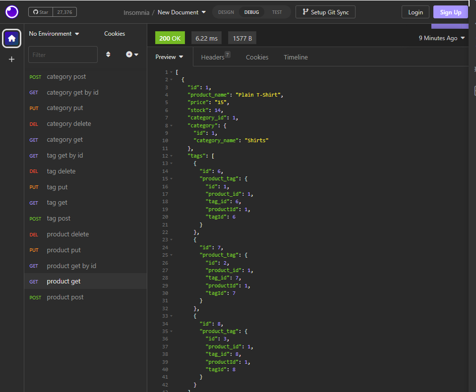

# Ecom-api
A backend api for a mock up e-commerce site.

## 
  
# Table of Contents:
  
  1. [Description](#description)
  2. [Installation](#installation)
  3. [Usage](#usage)
  4. [Contributors](#contributors)
  5. [License](#license)
  6. [Screenshot](#screenshot)
  7. [Link](#link)
  8. [Tests](#tests)
  9. [Questions](#questions)
 10. [Citing Credit](#citing)
  
## Description 

    This is a backend api for an ecommerce site, and can be used to store product data for use on a ecommerce website.

      
  
      
## Installation 

To install you will need to clone it from the repo, then create a .env file with your mysql server password and username, connect it to the data base written in the schema folder. Run mysql and source the scema file. Then on node again run npm install, then node seeds, and you will be good to go, just run node server to start the application.

## Usage 

  
    This can be used to store, update, delete, and retrieve data for an ecommerce site, and will be useful in managing stock, pricing, item categorization, and product labeling.

      
  
## Contributors 

 ttieman
  
## License 

  ### This application is covered under the [MIT LICENSE](https://opensource.org/licenses/MIT),
  and should be referred to for any questions about legal licensure considering 
  this application. 

## ScreenShot  

## Link

Demonstration video: [https://drive.google.com/file/d/14FjfKRHfLhZI48zL9ZF4flUxQP8ssy7_/view](https://drive.google.com/file/d/14FjfKRHfLhZI48zL9ZF4flUxQP8ssy7_/view)

To the Repo 
[https://github.com/ttieman/Ecom-api](https://github.com/ttieman/Ecom-api)  

  
  
## Tests 

### The testing was done using insomnia to check all the routes are working properly when communicating with the server.
  
## Questions 

  
### If you have and questions my git hub user is [ttieman](https://github.com/ttieman)
  
### My email is tiemantanner@gmail.com if you wish to reach out to me directly.

## Citing Credit

 Web3 schools was used for referencing javascript elements while building this application!

 [https://www.w3schools.com/](https://www.w3schools.com/)

 
 Sequelize was used in building this application and all 
 related documentation was from their website.

 [https://sequelize.org/](https://sequelize.org/)

